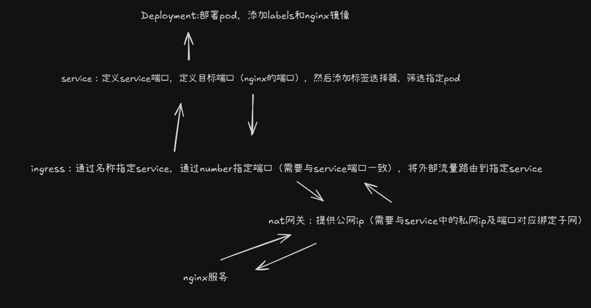
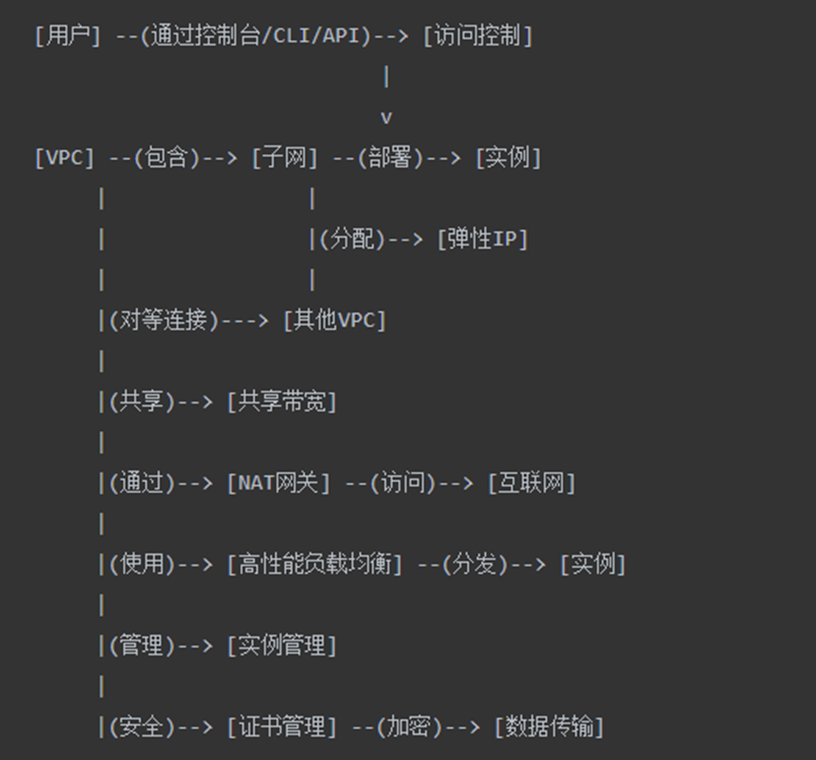

# 20250408实习沉淀

## k8s部署自己的服务

1. 需要将自己的服务打包成镜像
2. 通过镜像，构建deployment（同时运行多个副本，保证不会所有的服务都宕机）
3. 通过deployment中定义的pod的label，在service中做端口定义，标签选择器选择对应pod标签。type选择nodeport类型更简单
4. 设置ingress，通过name字段去对应service（填service的名称），然后number字段对应service中的port
5. 最后如果要外网访问，可以通过nat网关设置，获取一个公网ip，然后通过配置DNAT规则将私网ip映射到公网ip上
6. 本地host配好ip和域名映射，即可外网访问自己的服务

## docker打包镜像

1. 需要编写dockerfile（基本需要啥都要编译进去，比如自己的服务、数据库等，其中该数据库还必须要公网能访问，自己的实践是在启动一个数据库的容器，然后持久化存储）
2. 直接build，基本命令为`docker build your-service-name:tag .`
3. 其他命令可以看状态的，比如`docker ps`，个人认为是查当前容器是否运行等；`docker images`，查看所有已打包的镜像；`docker logs image-name`，查看运行日志，也可以是start或者stop或者run

## 服务器

服务器以后如果有接触选择香港的，然后可以看看小白debug的服务器推荐。

## NAT网关

用来配置公网ip的，隐藏私网ip，只暴露公网ip，通过公网ip路由到私网ip，然后再访问对应服务。

