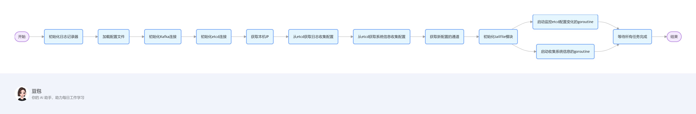

# 日志项目流程图

## 项目流程



## main中run


## 高频问题整理

### 1. 项目整体架构相关

#### 问题：请简要介绍一下这个 `logagent` 项目的整体架构和工作流程。

**答案**：`logagent` 项目主要用于收集日志和系统信息，并将其发送到 Kafka 中。整体工作流程如下：

1. 初始化：
   - 初始化日志记录器，方便后续记录项目运行中的信息。
   - 加载配置文件 `config.ini`，获取 Kafka、etcd 等的配置信息。
   - 初始化 Kafka 和 etcd 的连接。
   - 获取本机 IP 地址，用于从 etcd 中获取针对本机的日志收集和系统信息收集配置。
   - 初始化 `tailfile` 模块，用于监控日志文件的变化。
2. 运行：
   - 启动一个 goroutine 实时监控 etcd 中日志收集配置项的变化，根据变化动态管理 `tailObj`。
   - 启动另一个 goroutine 按照指定的时间间隔收集系统信息（如 CPU、内存、磁盘、网络等），并将其发送到 Kafka。
   - 等待所有任务完成。

### 2. 配置管理相关

#### 问题：项目中是如何管理配置信息的，为什么要使用 etcd 来存储配置？

**答案**：

- **配置管理方式**：项目使用 `github.com/go-ini/ini` 库来加载配置文件 `config.ini`，将配置信息映射到相应的结构体中。同时，使用 etcd 来存储动态配置，如日志收集的路径、系统信息收集的间隔和主题等。
- 使用 etcd 的原因：
  - **分布式一致性**：etcd 是一个分布式键值存储系统，能够保证数据的一致性，多个 `logagent` 实例可以从 etcd 中获取相同的配置信息。
  - **动态更新**：可以实时更新 etcd 中的配置，`logagent` 能够监控到这些变化并及时做出响应，无需重启服务。
  - **高可用性**：etcd 具有高可用性，能够在部分节点故障的情况下继续提供服务。

### 3. 日志收集相关

#### 问题：`tailfile` 模块是如何实现日志文件监控的，以及如何处理配置变化？

**答案**：

- **日志文件监控**：`tailfile` 模块使用 `github.com/hpcloud/tail` 库来实现对日志文件的监控。在 `Init` 函数中，会根据从 etcd 中获取的日志收集配置项，为每个配置项创建一个 `tailObj` 实例，并启动一个 goroutine 调用 `tObj.run()` 方法，该方法会持续监控日志文件的变化，当有新的日志行产生时，将其发送到 Kafka。
- **配置变化处理**：`tailfile` 模块会从 etcd 获取一个新日志配置项的通道 `newConfChan`。在 `tailTaskMgr` 的 `run` 方法中，会监听这个通道，当有新的配置项到来时，会遍历新的配置项，对于不存在的配置项，创建新的 `tailObj` 实例并启动监控；对于不再存在的配置项，取消对应的 `tailObj` 并从映射表中删除。

### 4. 系统信息收集相关

#### 问题：系统信息收集模块是如何收集 CPU、内存、磁盘和网络信息的，以及如何计算网络速率？

**答案**：

- 信息收集方式：系统信息收集模块使用

  ```
  github.com/shirou/gopsutil
  ```

  库来收集系统信息。具体如下：

  - **CPU 信息**：使用 `cpu.Percent` 方法获取 CPU 的使用率。
  - **内存信息**：使用 `mem.VirtualMemory` 方法获取内存的使用情况，如总内存、可用内存、已使用内存等。
  - **磁盘信息**：使用 `disk.Partitions` 方法获取磁盘分区信息，再使用 `disk.Usage` 方法获取每个分区的使用情况。
  - **网络信息**：使用 `net.IOCounters` 方法获取网络 IO 计数器信息，如发送和接收的字节数、数据包数等。

- **网络速率计算**：系统信息收集模块会记录上一次获取网络 IO 数据的时间点 `lastNetIOStatTimeStamp` 和上一次的网络 IO 数据 `lastNetInfo`。在每次获取新的网络 IO 数据时，计算时间间隔 `interval`，并根据上一次和当前的数据计算速率，公式为：`速率 = (当前值 - 上一次值) / 时间间隔`。

### 5. Kafka 相关

#### 问题：项目中是如何将日志和系统信息发送到 Kafka 的，以及如何处理发送失败的情况？

**答案**：

- **发送方式**：在日志收集和系统信息收集模块中，当获取到日志行或系统信息后，会将其转换为 JSON 格式，然后创建一个 `kafka.Message` 结构体，包含数据和主题信息。最后调用 `kafka.SendLog` 方法将消息发送到 Kafka。
- **发送失败处理**：在 `sendKafka` 方法中，当调用 `kafka.SendLog` 方法发送消息失败时，会使用 `log.Warnf` 记录错误信息，但不会进行重试，后续可能需要根据具体的业务需求添加重试机制。

### 6. 并发处理与同步

#### 问题：在 `run` 函数中使用了 `sync.WaitGroup` 来处理并发，能详细解释一下它的作用和在这个项目中的使用方式吗？

**答案**：

- **作用**：`sync.WaitGroup` 用于等待一组 goroutine 完成。它可以让主线程等待所有子 goroutine 执行完毕后再继续执行或退出，确保所有并发任务都能正常完成。
- **使用方式**：在 `run` 函数中，首先调用 `wg.Add(2)` 来设置需要等待的 goroutine 数量为 2。这表示有两个并发任务需要执行，分别是 `etcd.WatchConf(logConfKey)` 和 `sysinfo.Run(time.Duration(sysinfoConf.Interval)*time.Second, sysinfoConf.Topic)`。然后启动这两个 goroutine 来并发执行任务。最后调用 `wg.Wait()` 让主线程阻塞，直到这两个 goroutine 都完成任务。当每个 goroutine 完成任务时，需要在相应的代码中调用 `wg.Done()` 来通知 `WaitGroup` 该任务已完成。

### 7. 错误处理与程序健壮性

#### 问题：在 `main` 函数中，对于初始化过程中的错误使用了 `panic` 函数，这种处理方式有什么优缺点，你认为有更好的替代方案吗？

**答案**：

- **优点**：`panic` 函数可以快速终止程序并输出错误信息，能够及时发现和定位初始化过程中的严重错误，避免程序在错误的状态下继续运行。
- **缺点**：`panic` 会导致程序直接崩溃，无法进行优雅的错误处理和恢复。在生产环境中，这种方式可能会导致服务中断，影响系统的可用性。
- **替代方案**：可以使用返回错误信息的方式来处理错误。在 `main` 函数中，对于每个初始化步骤的错误，将错误信息返回并进行适当的处理，如记录日志、重试或进行资源清理等。例如：

```go
err := ini.MapTo(&cfg, "./conf/config.ini")
if err != nil {
    log.Errorf("init config failed, err:%v", err)
    // 可以进行一些资源清理操作
    return
}
```

### 8. 配置文件动态更新

#### 问题：项目中如何实现对配置文件的动态更新，以及如何确保更新后的配置能及时生效？

**答案**：

- **动态更新实现**：项目使用 etcd 来存储配置信息，并通过 `etcd.WatchConf` 函数实时监控 etcd 中日志收集配置项的变化。当配置项发生变化时，`etcd.WatchConf` 会获取新的配置信息，并将其发送到 `tailfile` 模块的 `newConfChan` 通道中。
- **确保及时生效**：`tailfile` 模块会监听 `newConfChan` 通道，当有新的配置信息到来时，会根据新的配置动态管理 `tailObj`。对于新增的配置项，会创建新的 `tailObj` 实例并启动监控；对于不再存在的配置项，会取消对应的 `tailObj` 并从映射表中删除，从而确保更新后的配置能及时生效。

### 9. 代码性能优化

#### 问题：从代码性能的角度考虑，你认为这个项目有哪些可以优化的地方？

**答案**：

- **消息发送优化**：在 `tailfile` 模块的 `run` 函数中，每次读取到新的日志行就发送到 Kafka，可能会导致频繁的网络请求。可以考虑使用批量发送的方式，将多条日志行合并成一个消息发送到 Kafka，减少网络开销。
- **资源管理优化**：在 `tailObj` 的 `run` 函数中，当 `ctx.Done()` 信号到来时，会调用 `t.instance.Cleanup()` 来清理资源，但在实际应用中，可以考虑更细致的资源管理，如在程序退出时，确保所有的 `tailObj` 都能正常关闭，避免资源泄漏。
- **并发控制优化**：在使用 goroutine 时，可以根据系统资源和任务的性质，合理控制并发数量，避免过多的 goroutine 导致系统资源耗尽。例如，可以使用 `semaphore` 来限制并发数量。

### 10. 项目可扩展性

#### 问题：如果要将这个项目扩展为支持更多的日志收集源（如 MySQL 慢查询日志、Nginx 访问日志等），你会如何实现？

**答案**：

- **配置扩展**：在 etcd 中添加新的日志收集配置项，包括新的日志文件路径、主题等信息。同时，修改 `config` 结构体和配置文件 `config.ini`，以支持新的日志收集源配置。
- **代码扩展**：在 `tailfile` 模块中，添加对新日志收集源的支持。可以根据不同的日志源类型，创建不同的 `tailObj` 实例，并在 `run` 函数中进行相应的处理。例如，对于 MySQL 慢查询日志，可以在发送到 Kafka 之前进行一些预处理，如解析 SQL 语句、提取关键信息等。
- **错误处理和监控**：添加对新日志收集源的错误处理和监控机制，确保在出现问题时能够及时发现和处理。例如，可以记录错误日志、发送报警信息等。