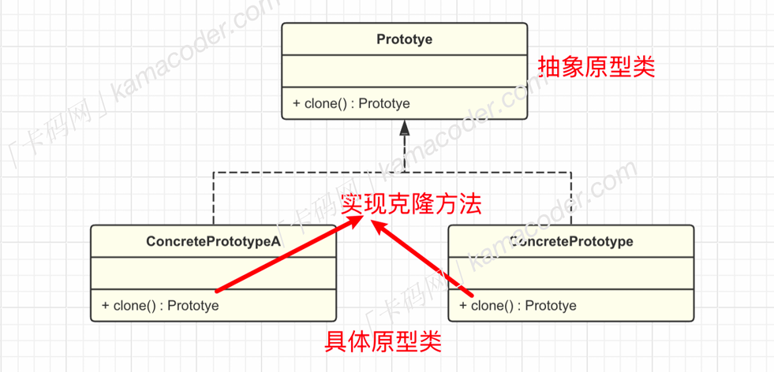

# 原型模式

## 定义

原型模式⼀种创建型设计模式，该模式的核⼼思想是基于现有的对象创建新的对象，⽽不是从头开始创建。 

在原型模式中，通常有⼀个原型对象，它被⽤作创建新对象的模板。新对象通过复制原型对象的属性和状态来创建，⽽⽆需知道具体的创建细节。

## 优势

如果⼀个对象的创建过程⽐较复杂时（⽐如需要经过⼀系列的计算和资源消耗），那每次创建该对象都需要消耗资 源，⽽通过原型模式就可以复制现有的⼀个对象来迅速创建/克隆⼀个新对象，不必关⼼具体的创建细节，可以降低对象创建的成本。

## 基本结构

实现原型模式需要给【原型对象】声明⼀个克隆⽅法，执⾏该⽅法会创建⼀个当前类的新对象，并将原始对象中的 成员变量复制到新⽣成的对象中，⽽不必实例化。并且在这个过程中只需要调⽤原型对象的克隆⽅法，⽽⽆需知道 原型对象的具体类型。 

原型模式包含两个重点模块： 

抽象原型接⼝ prototype : 声明⼀个克隆⾃身的⽅法 

具体原型类 ConcretePrototype :  实现 clone clone ⽅法，复制当前对象并返回⼀个新对象。 

在客户端代码中，可以声明⼀个具体原型类的对象，然后调⽤ clone() ⽅法复制原对象⽣成⼀个新的对象。



## 基本实现

原型模式的实现过程即上⾯描述模块的实现过程：
-创建⼀个抽象类或接⼝，声明⼀个克隆⽅法clone
-实现具体原型类，重写克隆⽅法
-客户端中实例化具体原型类的对象，并调⽤其克隆⽅法来创建新的对象。

## 使用场景

相⽐于直接实例化对象，通过原型模式复制对象可以减少资源消耗，提⾼性能，尤其在对象的创建过程复杂或对象
的创建代价较⼤的情况下。当需要频繁创建相似对象、并且可以通过克隆避免重复初始化⼯作的场景时可以考虑使
⽤原型模式，在克隆对象的时候还可以动态地添加或删除原型对象的属性，创造出相似但不完全相同的对象，提⾼
了灵活性。
但是使⽤原型模式也需要考虑到如果对象的内部状态包含了引⽤类型的成员变量，那么实现深拷⻉就会变得较为复
杂，需要考虑引⽤类型对象的克隆问题。

## 代码

[矩形原型](https://kamacoder.com/problempage.php?pid=1083)

自己的版本

```go
package main

import "fmt"

type Rectangle struct {
    Color string
    Width int
    Height int
}

type ProtoRectangle interface {
    Clone() *Rectangle
}

func (r *Rectangle) NewRectangle() *Rectangle {
    return &Rectangle{}
}

func (r *Rectangle) SetRectangle(color string, width, height int) *Rectangle {
    r.Color = color
    r.Width = width
    r.Height = height
    return r
}

func (r *Rectangle) Clone() *Rectangle {
    return &Rectangle{
        Color:  r.Color,
        Width:  r.Width,
        Height: r.Height,
    }
}

func main() {
    var color string
    var width, height int
    fmt.Scan(&color, &width, &height)
    //fmt.Println(color, width, height)
    var num int
    fmt.Scan(&num)
    rec := NewRectangle()
    rec = rec.SetRectangle(color, width, height)
    for num > 0 {
        copyRec := ProtoRectangle.Clone()
        fmt.Println("Color: ", copyRec.Color, "Width: ", copyRec.Width,"Height: ", copyRec.Height,)
        num--
    }
}
```

题解版本：

```go
package main

import "fmt"

type Rectangle struct {
    Color  string
    Width  int
    Height int
}

type ProtoRectangle interface {
    Clone() *Rectangle
}

func NewRectangle() *Rectangle {
    return &Rectangle{}
}

func (r *Rectangle) SetRectangle(color string, width, height int) *Rectangle {
    r.Color = color
    r.Width = width
    r.Height = height
    return r
}

func (r *Rectangle) Clone() *Rectangle {
    return &Rectangle{
        Color:  r.Color,
        Width:  r.Width,
        Height: r.Height,
    }
}

func main() {
    var color string
    var width, height int
    fmt.Scan(&color, &width, &height)

    var num int
    fmt.Scan(&num)

    rec := NewRectangle()
    rec.SetRectangle(color, width, height)

    var protoRec ProtoRectangle = rec//需要声明一个接口类型的变量（protoRec），并将rec赋值过去

    for num > 0 {
        copyRec := protoRec.Clone()
        fmt.Printf("Color: %s, Width: %d, Height: %d\n", copyRec.Color, copyRec.Width, copyRec.Height)
        num--
    }
}
```

> [!WARNING]
>
> 收获和注意内容如下：
>
> 1.对于实例化的构造函数（create和new函数），通常是包级别的函数，而不是一个实例方法。
>
> 2.实例方法的调用自己还不熟悉！！
>
> 3.对于克隆方法，应该使用结构体字面量，这个方法不需要传入参数，因为它直接使用接收者 `r` 的字段值来创建一个新的 `Rectangle`，方法更简洁。
>
> 4.对于抽象接口的方法调用：
>
> - `ProtoRectangle` 接口的 `Clone` 方法需要通过接口类型的变量来调用，而不是直接通过结构体类型调用。
> - `Clone` 方法的调用应该通过实现了 `ProtoRectangle` 接口的变量来进行。

