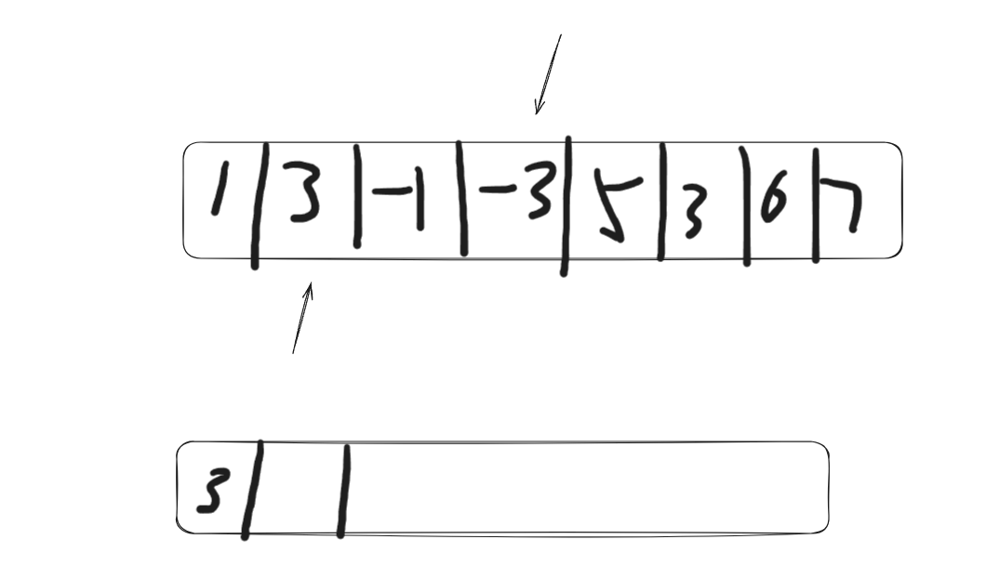
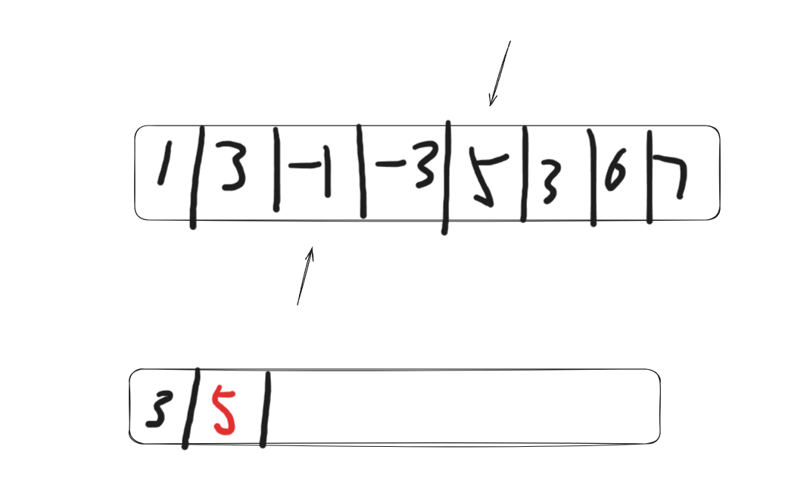

# 20250105算法补学

## 1.单调队列

主要记录一下自己在实现单调队列时疏忽和不清楚的地方：

1.这里指的是指向定义好的结构体的指针

```go
*MyQueue
```

2.这里指的是利用&符号获取MyQueue的地址，从而得到一个指针

```go
&MyQueue
```

3.push方法的实现

> 这里需要注意的是逻辑是**for**而不是**if**，因为只要队列前面有比压栈元素小的数，就要出队！

```go
func (m *MyQueue) Push(val int) {
	// 保证队列是递减的
	for !m.Empty() && m.queue[len(m.queue)-1] < val {//这里的；逻辑是for！！因为只要前面有小的，就要一直剔除
		m.queue = m.queue[:len(m.queue)-1]
	}
	m.queue = append(m.queue, val)
}
```

4.指针的区别

> 这里的m，是接收器，指向自己定义的结构（队列）
>
> 而m.queue是指向定义好的队列中的元素，即一个切片
>
> 所以m可以使用自定义的方法

```go
func (m *MyQueue) Pop() {
	if !m.Empty() {//m.queue.Empty是不正确的，因为m.queue是切片，切片是没有Empty方法（因为该方法为自定义），
		m.queue = m.queue[1:]//而m是接收器，指向自己定义的队列，而自己定义的队列，是有自定义方法Empty的！！！
	}
}
```

5.pop的时机

> 在窗口移动过程中，如果窗口最左边的边界元素等于队列中的出口元素，那么出口元素就需要出队，因为不出队的话，下一次移动，压栈后队列长度就会超界。（只不过因为队列只维护最大元素，所以看起来好像没有超界，但是即模拟过程中，nums数组上是超界的，需要处理）

```go
if i >= k-1 {
			res = append(res, deque.Front())
			// 移除队列中不属于当前窗口的元素
			if deque.Front() == nums[i-k+1] {//当窗口的最左边元素等于队列出口元素时，说明下次移动就会超出滑块的长度界限，所以需要把出口元素给pop
				deque.Pop()
			}
		}
```

以下是动画处理：

1.此时滑块再移动，就超过k了（假设k=3）



达到了如下情况：



因为已经超界了，所以滑块的最左边（之前的最左边）需要提前pop处理掉，也就是当滑块最左边等于队列出口元素时，pop出口元素。

6.如果数组长度小于k该如何处理

```go
return res//当数组长度小于k时，返回空数组（因为不可能形成滑动窗口）
```

> 这里我之前是想着给数组排序返回最大值，但是再一想，数组都没办法形成滑块，结果应该为空才对.
>
> 所以这里最后的return比较点睛，如果前面的逻辑都不对，那就直接返回一个空数组

## 2.大小顶堆

1.定义堆方法

> 这里需要定义五个方法：less、swap、len、pop、push，这样才能调用自带的heap库函数

2.关于指针和应用的细节

```go
func (h *IHeap) Push(x interface{}) {
    *h = append(*h, x.([2]int))
}

 // 定义并初始化小顶堆
 h := &IHeap{}
 heap.Init(h)
```

> `h` 是 `*IHeap` 类型的指针，它指向一个 `IHeap` 类型的数据。我们使用 `&` 操作符来取 `IHeap` 数据的地址，从而得到一个指向堆的指针。
>
> 当你使用 `*h` 时，它表示对 `h` 这个指针进行解引用，访问堆的数据。`*h` 实际上是一个 `IHeap` 类型的值，即一个 `[2]int]` 类型的切片。

3.倒序取值的新解法

因为如果按照切片倒序取的话，堆每次只能弹出根节点（也就是最小值），所以可以利用append方法，将res拆解，每次加在一个新弹出元素的后面，这样即是一个倒序的数组！

```go
// 从堆中倒序取出前k个频率最高的元素
    for h.Len() > 0 {
        top := heap.Pop(h).([2]int)
        res = append([]int{top[0]}, res...) // 神奇的操作，将切片拆开加在新建的弹出元素切片的后面
    }
```


