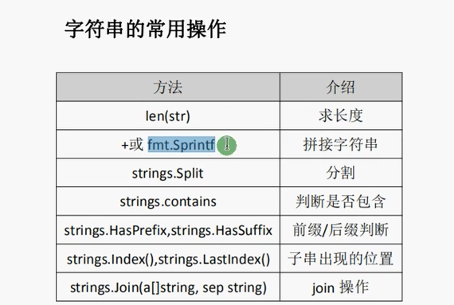

# 2025Go基础补学

## 1.浮点型

### **float32和float64**

1. **float32**：这是单精度浮点数，它使用 32 位（4 字节）来存储。float32 的范围大约是 1.4e-45 到 3.4e+38，精度大约是 6-7 位十进制数。
2. **float64**：这是双精度浮点数，它使用 64 位（8 字节）来存储。float64 的范围大约是 5e-324 到 1.8e+308，精度大约是 15-16 位十进制数。

> %f表示格式化输出，保留6位小数。如果是%.2f，则表示保留2位小数（可类推）

go中默认的float类型时float64。

科学计数法：

> 3.14e2，即3.14*10的平方

### 浮点型精度丢失

```go
var d float64 = 1129.6
fmt.Println(d*100)//输出112959.9999999999999
```

二进制小数和十进制小数转换可能有精度丢失。

可以用golang的第三方包解决：decimal。

### 整型与浮点型转换

```go
a := 10
b := float64(a)
fmt.Println(b)
```

## 2.布尔类型

true/false

1.不允许将整形强制转化成bool

2.bool无法参与数值运算，也无法与其他类型进行转换

3.默认为false

> string类型默认为空，int类型默认为0，float类型默认为0

## 3.字符串

字符串用双引号""包裹。

> 转义字符：\n，表示换行。更普遍来说应该是\，可以将别的字符转义

### 多行字符串

用反引号包裹（``），但所有转义字符在这里面无效

### 字符串常用操作



> [!NOTE]
>
> 需要实现引用strings包和fmt包

1.fmt.Sprintf拼接更加灵活

```go
str1 := "hello"
str2 := "world"
str3 := fmt.Sprintf("%v %v", str1, str2)
fmt.Println(str3)//hello world（根据格式化里面的字符的样式输出，%v之间有空格，就会有空格拼接）
```

2.分隔

```go
var a := "123-456"
b := strings.Split(a, "-")
fmt.Println(b)//[123 456]
```

3.join，把切片连接成字符串

```go
var a := "123-456"
b := strings.Split(a, "-")
c := strings.Join(b, "*")
fmt.Println(c)//"123*456"
```

4.是否包含

```go
var a := "hello"
b := "he"
c := strings.Contains(a, b)
fmt.Println(c)//true
```

5.前后缀（和contain操作一样）

```go
var a := "this is string"
b := "this"
c := "string"
d := strings.HasPrefix(a, b)
e := strings.HasSuffix(a, c)
fmt.Println(d)//true
fmt.Println(e)//true
```

6.判断子字符串出现的位置（查找不到返回-1）

```go
var a := "this is str"
b := "is"
num := strings.Index(a, b)//从前往后
fmt.Println(num)//2
num1 := strings.LastIndex(a, b)//从前往后
fmt.Println(num1)//5
```

## 4.字符

byte和rune

> 字符是用单引号包裹（''），是int型

```go
a := 'a'
fmt.Printf("值: %v  类型: %T", a, a)//值：97 类型： int32
```

输出的是a对应的ASCII码值

```go
a := 'a'
fmt.Printf("值: %c  类型: %T", a, a)//值：a 类型： int32
```

> %c可以输出字符原值

### 字符种类

1.uint8，即byte类型，代表ASCII码的一个字符

```go
str := "this"
fmt.Printf("值: %v  类型: %T", str[2], str[2])//值： 105 类型： uint8
```

> 因为this里的i是字符，所以打印出来是对应的ASCII码值！！！
>
> 原值输出可以用%c
>
> 在go中，一个字母占用一个字节，一个汉字（UTF-8编码）占用三个字节

如果想获取字符串的字节数，直接使用len()即可

```go
var s = "你好go"
fmt.Println(len(s)//8
```

循环输出字符：

```go
s := "你好 golang"
for i := 0; i < len(s); i++ {//byte类型
    fmt.Println(s[i])
}//有汉字会乱码，如果只有golang，则输出对应的ASCII码值
```

```go
for _, r := range s {//rune类型
     fmt.Println(r)//输出对应的utf-8编码值，且这个时候不会乱码，因为汉字也是utf-8编码
}
```

2.rune, 代表UTF-8字符

> 当需要处理中文、日文、复合字符、byte类型时适用，实际为int32类型


### 修改字符串

只要涉及修改，就要先将string转为[]byte或[]rune类型，最后结果再转回string，并且都会重新分配内存，并复制字节数组

```go
s := "big"
b := "你好"
strByte := []byte(s)
strByte[0] = 'p'
fmt.Println(string(strByte))//"pig"
//分界线--------------------------------
strRune := []rune(b)
strRune[0] = '不'
fmt.Println(string(strRune))//"不好"
```

## 5.基本数据转换

### 整型和浮点型

建议将整形转化为浮点型，因为浮点型转化为整型时，可能会丢失小数点后的部分

### 将其他类型转化为string

可以利用Sprintf来转化，也可以利用strconv包来转化

```go
//Sprintf
var i int = 20
var f float64 = 12..456
var t bool = true//bool类型输出为%t
var b byte = 'a'//字符原值输出应为%c
s1 := fmt.Sprintf("%d", i)
fmt.Printf("值: %v 类型: %T",s1, s1)//值: 20 类型: string
```

```go
//strconv包
import "strconv"

var i int64 = 20
s1 := strconv.FormatInt(i, 10)//后一个参数为需要转换的进制，本次为10进制；前一个参数应为int64类型
fmt.Printf("值: %v 类型: %T",s1, s1)//值: 20 类型: string
```

### string类型转化为整形或者浮点型

strconv包中的ParseInt和ParseFloat方法

> ParseInt参数：
>
> 参数1：string数据
>
> 参数2：进制
>
> 参数3：位数（32 64）

```go
s := "123.333"
num, _ := strconv.ParseFloat(s, 64)//下划线为省略的err参数
fmt.Printf("值: %v 类型: %T",s, s)//值: 123.333 类型: float64
```

## 6.运算符

> 除法：如果都是整数，/结果为整数（有小数则取整）；如果都是浮点数，才会有小数；%为取余
>
> ++和--是单独语句，不是运算符，只能单独使用如i++，而不能是a = i++
>
> 赋值运算符：+=， -=之类的

位运算符

## 7.流程控制

使用Switch……case……方便对大量值进行条件判断。并且go中只能有一个default分支

```go
switch expression {
    case condition:
}
```

go中的switch有fallthrough（穿透），可以执行满足条件的分支的下一个分支（一次只能穿透一个分支）

```go
var age = 30
switch {
    case age < 24:
    fmt.Println("蔡徐坤")
    case age >= 24 && age < 60:
    fmt.Println("陈立农")
    fallthrough
    case age >= 60:
    fmt.Println("范丞丞")
    default:
    fmt.Println("侯明昊")
    //输出陈立农
    //范丞丞
}
```

### break/continue

如果想要跳出多重循环，可以标一个label

```go
label1:  
    for i := 0; i < 5; i++ {
            for j :=0; j < 4; j++ {
                //逻辑语句
                break label1
            }
        }
```

如果continue对着label使用的话，表示开始标签对应的循环

### goto（跳转到指定标签）

快速跳出循环（无条件跳转）

```go

    var n = 30
    if n > 24 {
        //逻辑
        goto label1
    }
////逻辑2
label1:
 //逻辑3

//打印完if里的语句后，会直接跳转到label1下的逻辑语句
```

## 8.数组（值类型）

```go
var i = [...]int{1,2}//允许编译器根据后面的值的数量自动初始化长度
```

```go
var i = [...]int{0:1, 1:2, 5:3}//数组长度为6（因为最后一个下标为5），并且下标0,1,5的元素已经被赋值
```

> 基本数据类型和数组都是值类型（拷贝的部分改变，原值不会跟着改变）
>
> 引用类型：拷贝的部分改变，原值也会跟着改变（拷贝的部分和原值指向同一个地址）

### 多维数组

```go
var s = [3][2]int{}//三行两列
```

> [!NOTE]
>
> 多维数组只有第一层可以使用...来让编译器推导数组长度。

## 9.切片

数组的初始化需要指定中括号内的数组长度，切片可以不指定。

> 默认零值：
>
> bool : false
>
> numbers : 0
>
> string : ""
>
> pointers : nil
>
> slices : nil
>
> maps : nil

len()可以获取切片长度（包含所有元素的个数），cap()可以获取切片容量（从**第一个元素**开始，到底层数组元素**末尾**的个数。）

go中没法通过下标的方式给切片扩容，扩容需要append

扩容的方式有新增1，新增两倍，新增四分之一。

> 由于切片是引用类型，如果想要不改变原值，可以使用copy()方法复制切片

> [!IMPORTANT]
>
> 基本数据类型：整型， 浮点型， 布尔类型， 字符串
>
> 复合数据类型：数组、切片、结构体、函数、map、通道（channel）、接口

