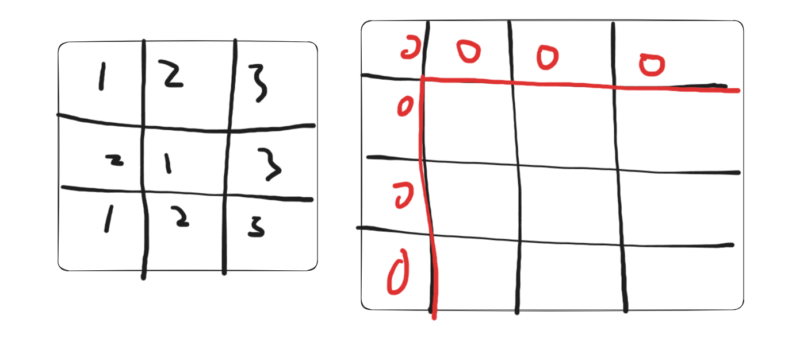

# 20250107土地开发商超绝补录

[开发商购买土地](https://kamacoder.com/problempage.php?pid=1044)

这题拖了很久，今天才算是完全手写走通了一遍。主要难点如下：

> 1.go中没有高效读取数字的、已经定义好的方法
>
> 2.利用bufio的缓冲读取需要增加额外的时间成本去学习，包括读取、字符串与整型转换
>
> 3.二维前缀和的思路不明确，当时第一次写完全没联想到前缀和。

不过现在都没问题了，代码如下：

```go
package main

import (
    "fmt"
    "os"
    "bufio"
    "strings"
    "strconv"
    "math"
)
    
func main() {
    var n, m int
    
    reader := bufio.NewReader(os.Stdin)
    
    line, _ := reader.ReadString('\n')
    line = strings.TrimSpace(line)
    params := strings.Split(line, " ")
    
    n, _ = strconv.Atoi(params[0])
    m, _ = strconv.Atoi(params[1])//n和m读取完成
    
    land := make([][]int, n)//土地矩阵初始化
    
    for i := 0; i < n; i++ {
        line, _ := reader.ReadString('\n')
        line = strings.TrimSpace(line)
        values := strings.Split(line, " ")
        land[i] = make([]int, m)
        for j := 0; j < m; j++ {
            value, _ := strconv.Atoi(values[j])
            land[i][j] = value
        }
    }//所有读取完成
    
    //初始化前缀和矩阵
    preMatrix := make([][]int, n+1)
	for i := 0; i <= n; i++ {
		preMatrix[i] = make([]int, m+1)
	}
    
    for a := 1; a < n+1; a++ {
        for b := 1; b < m+1; b++ {
            preMatrix[a][b] = land[a-1][b-1] + preMatrix[a-1][b] + preMatrix[a][b-1] - preMatrix[a-1][b-1]
        }
    }
    
    totalSum := preMatrix[n][m]
    
    minDiff := math.MaxInt32//初始化极大数，用于比较
    
    //按行分割
    for i := 1; i < n; i++ {
        topSum := preMatrix[i][m]
        
        bottomSum := totalSum - topSum
        
        diff := int(math.Abs(float64(topSum - bottomSum)))
        if diff < minDiff {
            minDiff = diff
        }
    }
    
    //按列分割
    for j := 1; j < m; j++ {
        topSum := preMatrix[n][j]
        
        bottomSum := totalSum - topSum
        
        diff := int(math.Abs(float64(topSum - bottomSum)))
        if diff < minDiff {
            minDiff = diff
        }
    }    
    
    fmt.Println(minDiff) 
}
```

手写本题后，具体收获如下：

> 1.熟悉了bufio的读取写法：go中很多库函数基本都要做错误判断，这个不能省略（包括strconv）
>
> 2.了解了math中的绝对值是针对float64的，所以还需要经过几次类型转换
>
> 3.前缀和中，当前矩阵的元素再前缀和矩阵中横纵索引都需要**-1**！！！！
>
> 4.前缀和矩阵初始化多一行一列，原因就是要取前缀和矩阵中元素的上方和左方元素做计算，多初始化一部分省去了边界的处理（同样是哑节点的思路）

比如下方示意图，从（1,1）开始，红框内才是真正的前缀和，所以i和j都要从1开始取。主要就是两个矩阵的规模不一样，所以索引的取值需要注意。



后面初始化极大数用来取小、以及横纵分割相对简单。

> [!NOTE]
>
> 在go中的读取有两种，一是fmt的scan方法，另一种是bufio的读写方法。两者差异如下：
>
> ​	1.fmt的scan方法读写自动化程度高，不管什么类型，基本都不需要自己再转换，但效率低。因为每次都会和系统缓冲区建立联系，频繁调度。
>
> ​	2.bufio效率高，它是自己建立一个缓冲区，每次读取会先看看自己的缓冲区里是否含有目标元素（默认一次读取固定的数量），这样减少了系统调度，但需要经过麻烦的处理和转换，才能变成想要的数据类型。

