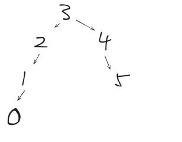

# 20250114算法留痕+二叉树总结

## 1.[669. 修剪二叉搜索树](https://leetcode.cn/problems/trim-a-binary-search-tree/)

这一题写的比较困哪，对于low和high同处一边的情况容易理解，但对于中间节点处在low和high之间的再次左右节点处理考虑不到位

递归版本：

```go
/**
 * Definition for a binary tree node.
 * type TreeNode struct {
 *     Val int
 *     Left *TreeNode
 *     Right *TreeNode
 * }
 */
func trimBST(root *TreeNode, low int, high int) *TreeNode {
    if root == nil {
        return nil
    }
    if root.Val < low {     //如果该节点值小于最小值，则该节点更换为该节点的右节点值，继续遍历
        right := trimBST(root.Right, low, high)
        return right
    }
    if root.Val > high {    //如果该节点的值大于最大值，则该节点更换为该节点的左节点值，继续遍历
        left := trimBST(root.Left, low, high)
        return left
    }
    root.Left = trimBST(root.Left, low, high)
    root.Right = trimBST(root.Right, low, high)
    return root
}
```

迭代版本：

```go
/**
 * Definition for a binary tree node.
 * type TreeNode struct {
 *     Val int
 *     Left *TreeNode
 *     Right *TreeNode
 * }
 */
func trimBST(root *TreeNode, low int, high int) *TreeNode {
    if root == nil {
        return nil
    }
    // 处理 root，让 root 移动到[low, high] 范围内，注意是左闭右闭
    for root != nil && (root.Val < low || root.Val > high) {
        if root.Val < low {
            root = root.Right
        } else {
            root = root.Left
        }
    }
    cur := root
    // 此时 root 已经在[low, high] 范围内，处理左孩子元素小于 low 的情况（左节点是一定小于 root.Val，因此天然小于 high）
    for cur != nil {
        for cur.Left != nil && cur.Left.Val < low {
            cur.Left = cur.Left.Right
        }
        cur = cur.Left
    }
    cur = root
    // 此时 root 已经在[low, high] 范围内，处理右孩子大于 high 的情况
    for cur != nil {
        for cur.Right != nil && cur.Right.Val > high {
            cur.Right = cur.Right.Left
        }
        cur = cur.Right
    }
    return root
}
```

## 2.[108. 将有序数组转换为二叉搜索树](https://leetcode.cn/problems/convert-sorted-array-to-binary-search-tree/)

这一题递归比较容易，迭代比较难，故只展示递归的代码。本题的注意点如下：

> 平衡二叉树，是指每一个子树都是平衡的（即每一个子树的左右子树高度差绝对值不超过1）
>
> 
>
> 图中的数就不是平衡二叉树，因为节点2的左子树高度为2，右子树高度为0，高度差绝对值超过1！！！！
>
> 高度指根节点到叶子结点途中的最长路径；深度指该节点到根节点的路径长度；

递归版本：

```go
/**
 * Definition for a binary tree node.
 * type TreeNode struct {
 *     Val int
 *     Left *TreeNode
 *     Right *TreeNode
 * }
 */
func sortedArrayToBST(nums []int) *TreeNode {
    if len(nums) == 0 {
        return nil
    }
    var root *TreeNode
    i := len(nums)/2 
    root = &TreeNode{Val: nums[i]} 
    root.Left = sortedArrayToBST(nums[:i])
    root.Right = sortedArrayToBST(nums[i+1:])
    return root
}
```

## 3.[538. 把二叉搜索树转换为累加树](https://leetcode.cn/problems/convert-bst-to-greater-tree/)

这题主要是想的太复杂了，习惯性想往数组上操作，实际在树上就可以遍历累加（逆中序即可），同时这一题再次巩固了中序遍历的处理方式。

递归版本：

```go
/**
 * Definition for a binary tree node.
 * type TreeNode struct {
 *     Val int
 *     Left *TreeNode
 *     Right *TreeNode
 * }
 */
func convertBST(root *TreeNode) *TreeNode {
	var pre *TreeNode
	var order func(node *TreeNode)
	order = func(node *TreeNode) {
        if node == nil {
            return
        }
		order(node.Right)
		if pre != nil {
			node.Val = node.Val + pre.Val
		}
		pre = node
		order(node.Left)
	}
    order(root)
    return root
}
```

迭代版本：

```go
/**
 * Definition for a binary tree node.
 * type TreeNode struct {
 *     Val int
 *     Left *TreeNode
 *     Right *TreeNode
 * }
 */
func convertBST(root *TreeNode) *TreeNode {
    if root == nil {
        return root
    }
    var pre *TreeNode
    st := list.New()
    node := root

    for node != nil || st.Len() > 0 {
        for node != nil {
            st.PushBack(node)
            node = node.Right
        }

        node = st.Remove(st.Back()).(*TreeNode)
        if pre != nil {
            node.Val += pre.Val
        }
        pre = node

        node = node.Left
    }
    return root
}
```

> [!NOTE]
>
> 注意中间节点过后的节点更新情况。进入循环后，会先将当前节点压入，再压入所有右节点（这题是逆中序）

## 4.二叉树总结

1.递归和迭代的调用：如果涉及到顺序了，迭代才需要使用栈，不然类似二叉搜索树这种已经排序的，不需要使用栈来迭代处理。

2.中序遍历和前后遍历不同，要先将当前节点的一侧节点全部压入栈来处理。

3.递归中递归左右子节点时，对应迭代中压栈左右子节点（如果需要判断是否为nil的情况，递归是if，迭代就对应着for）

4.关于递归时递归函数的参数设置、是否需要返回值：

- 如果需要搜索整棵二叉树且不用处理递归返回值，递归函数就不要返回值。
- 如果需要搜索整棵二叉树且需要处理递归返回值，递归函数就需要返回值。 
- 如果要搜索其中一条符合条件的路径，那么递归一定需要返回值，因为遇到符合条件的路径了就要及时返回。

5.回溯的题目自己不太熟，如果有机会review的话，重点看回溯！！！

6.二叉树题目分类：

- 涉及到二叉树的构造，无论普通二叉树还是二叉搜索树一定前序，都是先构造中节点。
- 求普通二叉树的属性，一般是后序，一般要通过递归函数的返回值做计算。
- 求二叉搜索树的属性，一定是中序了，要不白瞎了有序性了。

