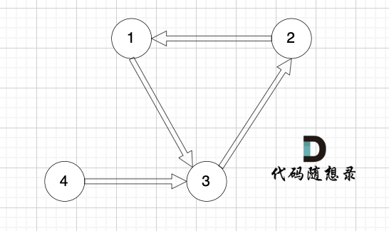
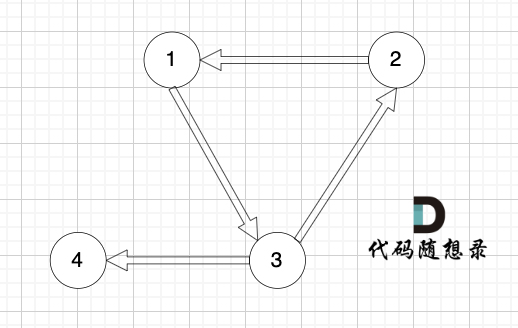

# 20250224算法留痕+并查集应用

## [108.冗余连接](https://kamacoder.com/problempage.php?pid=1181)

这一题就是简单应用，如果在一个集合里，再次加入的话就会出现环，如果不在集合里，那就加到集合里。

```go
package main

import (
    "fmt"
    "os"
    "bufio"
)

var n int

var father [1001]int

func initUnionFind() {
    for i := 1; i <= n; i++ {
        father[i] = i
    }
}

func find(u int) int {
    if father[u] == u {
        return u
    } 
    father[u] = find(father[u])
    return father[u]
}

func isSame(u, v int) bool {
    return find(u) == find(v)
}

func join(u, v int) {
    rootU := find(u)
    rootV := find(v)
    if rootV != rootU {
        father[rootU] = rootV
    }
}

func main() {
    var s, t int
    scanner := bufio.NewScanner(os.Stdin)
    scanner.Scan()
    fmt.Sscanf(scanner.Text(), "%d", &n)
    initUnionFind()
    for i := 0; i < n; i++ {
        scanner.Scan()
        fmt.Sscanf(scanner.Text(), "%d %d", &s, &t)
        if isSame(find(s), find(t)) {//判断是否在同一个集合，如果在，就说明存在环，打印即可
            fmt.Println(s, t)
            break
        } else {
           join(s, t) //如果不存在，就加入集合，
        }
    }
}
```

## [109.冗余连接II](https://kamacoder.com/problempage.php?pid=1182)

这一题比较复杂，需要考虑三种情况：

> 1.入度为2
>
> ​	1.1，入度的两条边在环中，则删除输入顺序靠后的
>
> 
>
> ​	1.2，入度的两条边有一条不在环中，那需要指定删除的边（判断删除后是否能构成树）
>
> 
>
> 2.有向环：这种情况就是正常冗余连接，直接排除即可
>
> 

```go
package main

import (
	"fmt"
	"os"
	"bufio"
)

var n int
var father [1001]int
var edges [][]int

// 并查集初始化
func initUnionFind() {
	for i := 1; i <= n; i++ {
		father[i] = i
	}
}

// 并查集里寻根的过程
func find(u int) int {
	if u == father[u] {
		return u
	}
	father[u] = find(father[u])
	return father[u]
}

// 将v->u这条边加入并查集
func join(u, v int) {
	u = find(u)
	v = find(v)
	if u != v {
		father[v] = u
	}
}

// 判断u和v是否找到同一个根
func isSame(u, v int) bool {
	return find(u) == find(v)
}

// 在有向图里找到删除的那条边，使其变成树
func getRemoveEdge() {//冗余连接
	initUnionFind() // 初始化并查集
	for i := 0; i < n; i++ { // 遍历所有的边
		if isSame(edges[i][0], edges[i][1]) { // 构成有向环了，就是要删除的边
			fmt.Println(edges[i][0], edges[i][1])
			return
		} else {
			join(edges[i][0], edges[i][1])
		}
	}
}

// 删一条边之后判断是不是树
func isTreeAfterRemoveEdge(deleteEdge int) bool {
	initUnionFind() // 初始化并查集
	for i := 0; i < n; i++ {
		if i == deleteEdge {
			continue
		}
		if isSame(edges[i][0], edges[i][1]) { // 构成有向环了，一定不是树
			return false
		}
		join(edges[i][0], edges[i][1])
	}
	return true
}

func main() {
	scanner := bufio.NewScanner(os.Stdin)
	scanner.Scan()
	fmt.Sscanf(scanner.Text(), "%d", &n)

	inDegree := make([]int, n+1) // 记录节点入度
	edges = make([][]int, n)

	for i := 0; i < n; i++ {
		var s, t int
		scanner.Scan()
		fmt.Sscanf(scanner.Text(), "%d %d", &s, &t)
		inDegree[t]++
		edges[i] = []int{s, t}
	}

	vec := []int{} // 记录入度为2的边（如果有的话就两条边）
	// 找入度为2的节点所对应的边，注意要倒序，因为优先删除最后出现的一条边
	for i := n - 1; i >= 0; i-- {
		if inDegree[edges[i][1]] == 2 {
			vec = append(vec, i)
		}
	}

	// 情况一、情况二
	if len(vec) > 0 {
		// 放在vec里的边已经按照倒序放的，所以这里就优先删vec[0]这条边
		if isTreeAfterRemoveEdge(vec[0]) {
			fmt.Println(edges[vec[0]][0], edges[vec[0]][1])
		} else {
			fmt.Println(edges[vec[1]][0], edges[vec[1]][1])
		}
		return
	}

	// 处理情况三
	// 明确没有入度为2的情况，那么一定有有向环，找到构成环的边返回就可以了
	getRemoveEdge()
}
```

> [!WARNING]
>
> 这一题需要判断入度，入度为2则说明有两个根节点，是不满足的（不满足有向树）！！


