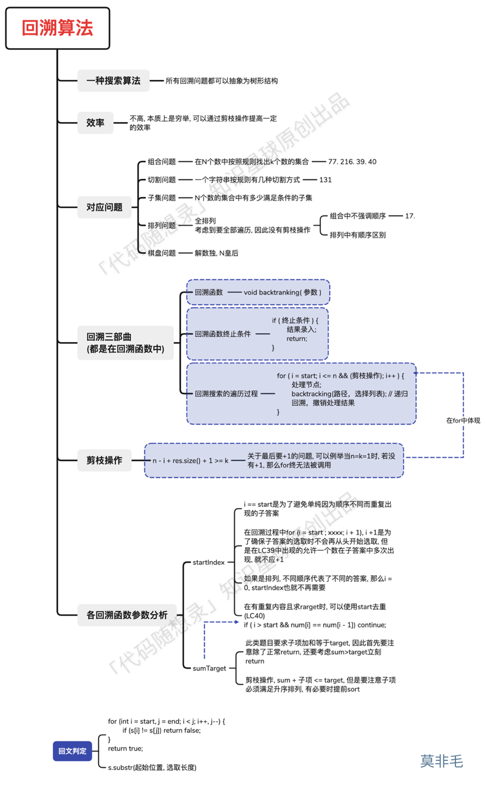

# BackTrack

## 解决问题

回溯法，一般可以解决如下几种问题：

- 组合问题：N个数里面按一定规则找出k个数的集合
- 切割问题：一个字符串按一定规则有几种切割方式
- 子集问题：一个N个数的集合里有多少符合条件的子集
- 排列问题：N个数按一定规则全排列，有几种排列方式
- 棋盘问题：N皇后，解数独等等

其中，**组合是不强调元素顺序的，排列是强调元素顺序**。

**回溯法解决的问题都可以抽象为树形结构**。

因为回溯法解决的都是在集合中递归查找子集，**集合的大小就构成了树的宽度，递归的深度就构成了树的深度**。

递归就要有终止条件，所以必然是一棵高度有限的树（N叉树）。

## 三部曲

### 回溯函数模板返回值以及参数


### 回溯函数终止条件

```go
if 终止条件 {
    存放结果;
    return;
}
```


### 回溯搜索的遍历过程


```go
for (选择：本层集合中元素（树中节点孩子的数量就是集合的大小）) {
    处理节点;
    backtracking(路径，选择列表); // 递归
    回溯，撤销处理结果
}
```

**for循环横向遍历，递归纵向遍历，回溯不断调整结果集**。

## 注意点

1.向结果中添加path时，一般都需要复制，因为回溯会改变path，不能让添加到答案的path和原来的path共享底层数组。

2.去重的逻辑（在有重复内容并且求target时），要记住内层循环i从index开始，这样做能做到树层去重。（也可以考虑用used数组，对f和t的区别做仔细思考），因为每次index传进去的时候自增，就会让之前用过的数字不会再出现

3.对于used数组，如果nums[i] = nums[i-1]并且used[i-1] = false,说明同一树层上有两个重复元素，不能重复选取

4.对于排列问题，i起始每次都从0开始，因为排序有序，（2，1）和（1，2）是两个东西

5.对于需要index的地方：如果是一个集合来求组合的话，就需要startIndex；如果是多个集合取组合，各个集合之间相互不影响，那么就不用startIndex。


