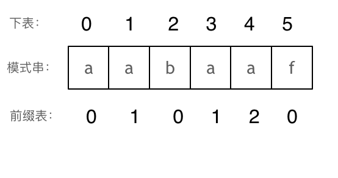

# String

## for循环细节

[541. 反转字符串II (opens new window)](https://programmercarl.com/0541.反转字符串II.html)中，一些同学可能为了处理逻辑：每隔2k个字符的前k的字符，写了一堆逻辑代码或者再搞一个计数器，来统计2k，再统计前k个字符。

其实**当需要固定规律一段一段去处理字符串的时候，要想想在在for循环的表达式上做做文章**。

只要让 i += (2 * k)，i 每次移动 2 * k 就可以了，然后判断是否需要有反转的区间。

因为要找的也就是每2 * k 区间的起点，这样写程序会高效很多。

## KMP

使用KMP可以解决两类经典问题：

1. 匹配问题：[28. 实现 strStr()(opens new window)](https://programmercarl.com/0028.实现strStr.html)
2. 重复子串问题：[459.重复的子字符串](https://programmercarl.com/0459.重复的子字符串.html)

**前缀是指不包含最后一个字符的所有以第一个字符开头的连续子串**。

**后缀是指不包含第一个字符的所有以最后一个字符结尾的连续子串**。

**前缀表要求的就是相同前后缀的长度。**



动图演示：


找到的不匹配的位置， 那么此时我们要看它的前一个字符的前缀表的数值是多少。

为什么要前一个字符的前缀表的数值呢，因为要找前面字符串的最长相同的前缀和后缀。

所以要看前一位的 前缀表的数值。

前一个字符的前缀表的数值是2， 所以把下标移动到下标2的位置继续比配。 可以再反复看一下上面的动画。

最后就在文本串中找到了和模式串匹配的子串了。

```go
package main

import (
	"fmt"
)

// getNext 构建KMP算法中的next数组
func getNext(next []int, s string) {
	j := 0
	next[0] = 0 // next数组的第一个元素总是0

	for i := 1; i < len(s); i++ {
        // 当字符不匹配且j不为0时，回退到上一个匹配的位置(这里是for，需要一直回退)
		for j > 0 && s[i] != s[j] {
			j = next[j-1]// 注意这里，是要找前一位的对应的回退位置了
		}
		// 如果字符匹配，增加j
		if s[i] == s[j] {
			j++
		}
		next[i] = j
	}
}

// strStr 使用KMP算法在haystack中查找needle的第一个出现位置
func strStr(haystack string, needle string) int {
	if len(needle) == 0 {
		return 0 // 如果needle为空字符串，返回0
	}

	// 初始化next数组
	next := make([]int, len(needle))
	getNext(next, needle)

	j := 0 // 指向needle的指针

	for i := 0; i < len(haystack); i++ {
		// 当字符不匹配且j不为0时，回退到上一个匹配的位置
		for j > 0 && haystack[i] != needle[j] {
			j = next[j-1]
		}
		// 如果字符匹配，增加j
		if haystack[i] == needle[j] {
			j++
		}
		// 如果j等于needle的长度，说明找到了匹配
		if j == len(needle) {
			return i - len(needle) + 1 // 返回匹配的起始索引
		}
	}

	return -1 // 如果没有找到匹配，返回-1
}

```

